# 🚀 Deployment Flow Overview
This guide outlines the steps to deploy and securely connect to an Azure Kubernetes Service (AKS) private cluster using Cloud Shell with VNet integration, following a hub-and-spoke network topology.

 ## Access Options Flow 
For the purpose of this demonstration, access to the AKS private cluster will be established using Access Option 3.   

## 🧱 Existing Infrastructure 
- Using a Free Azure Subscription 
- Owner role already assigned on the subscription. 
- Hub & spoke Network Topology is already configured:
    - *Hub VNet*:  Hosts Cloud Shell (VNet-integrated).
    - *Spoke VNet*: Hosts the AKS Private Cluster.
    - *VNet Peering*: Established between Hub and Spoke VNets.

## ☸️ AKS Private Cluster Deployment

To deploy the AKS private cluster with a private API server endpoint, follow these steps in the Azure Portal:  

**1. Navigate to AKS Service**    
   - Go to the Azure Portal and search for Kubernetes services, then click Create.

**2. Configure Basics**
  - Fill in the required fields such as:
    -  Subscription  
    -  Resource Group  
    -  Cluster name   
    -  Region   

**3. Click "Next" Until You Reach the Networking Tab**   
Proceed through the tabs (Node Pools, Authentication, etc.) until you reach Networking.   

**4. Enable Private Access**  
  - In the Networking tab:
     - Check Enable private cluster (Note: The option Public access - Set authorized IP ranges will be greyed out) 
     - If you have already created an Azure Virtual Network, you may choose to use it by selecting the **Bring your own VNet** option. Otherwise, leave it unchecked to allow Azure to automatically create a new Virtual Network for the cluster. 
     - Optionally configure DNS name prefix or leave it to be auto-created.   
     - Review + Create   

**5. Edit the name of Infrastructure Resource Group** 
- In Advanced tab:   
   - If you need to modify the name of infrastructure resource group of AKS, click on Edit and change the name.      

**6. Click Review + Create, validate the configuration, and then click Create to deploy the cluster.**   

## What looks like Infrastructure Resource Group Resources

The following resources are provisioned as part of the AKS cluster deployment. 

## 🔗  Link Hub VNet (VNet where Cloud Shell ACI will be deployed) to Private DNS Zone   
**1. Locate the AKS Private DNS Zone**
- Go to Private DNS Zones in Azure Portal.
- The zone name will look like: privatelink.<region>.azmk8s.io (e.g., privatelink.northeurope.azmk8s.io)

**2. Link the Hub VNet in my case to the Private DNS Zone**
- In the Private DNS Zone:
  - Under DNS Management → Virtual Network Links
  - Click + Add
    

 
- Enter a Link Name (e.g., dnslink-vnet-hub)
- Select the Hub VNet from the dropdown
- Choose whether to enable Auto-registration (usually disabled for AKS)
- Click Create

## 🔧 Prerequisites for Cloud Shell VNet Integration
To configure Azure Cloud Shell with Virtual Network integration, the following components must be provisioned:

- **Network Profile**: Defines the network configuration for the Cloud Shell container, including subnet and IP settings.
- **Azure Relay Namespace**: Facilitates secure communication between the Cloud Shell container and Customer Browser.
- **File Share (Storage Account)**: Used to persist Cloud Shell session data across restarts. 

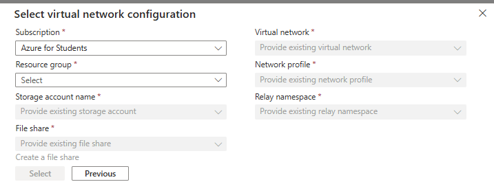

**PS: The above resources are automatically deployed via the ARM Template Azure Cloud Shell,except the File Share that should be deployed manually.**
👉 **Important:
Please make sure to check the section "Deploy Azure Relay Namespace" for additional deployment steps and configuration details.**

   ###  Create a Storage Account in Azure Portal
   **1. Go to Azure Portal** 
   Navigate to https://portal.azure.com and sign in.
     
   **2. Search for "Storage Accounts"**
   In the top search bar, type Storage Accounts and select it.  
     
   **3. Click "Create"**
   Click the + Create button to start the wizard.  
     
   **4. Fill in the Basics:**
    
   - Subscription: Select your active subscription.
   - Resource Group: A resource group where you will have Storage account and Azure Relay namespace.
   - Storage Account Name: Enter a globally unique name (e.g., hubstorageaccount).
   - Region: Select North Europe.
   - Performance: Standard.
   - Redundancy: Choose Locally-redundant storage (LRS). (Unless you need high availability but for the sake of this demo I used LRS)
   - Click "Review + Create", then Create
   - Azure will validate the configuration and deploy the storage account.
     
   

   ####   Create a File Share Inside the Storage Account
   **1. Navigate to the Storage Account**   
   Once deployed, go to the newly created storage account.
     
   **2. Select "File shares" from the left menu**  
   Under Data storage, click File shares.
     
   **3. Click "+ File share"**  

   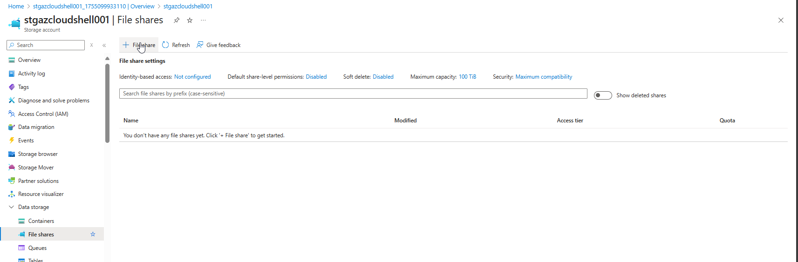
     
   Provide:
   - Name: e.g., fs-azurecloudshell
   - Quota: Optional (e.g., 5 GB) (You have to do it via Edit on File Share after creation)
   - Click Create
     
   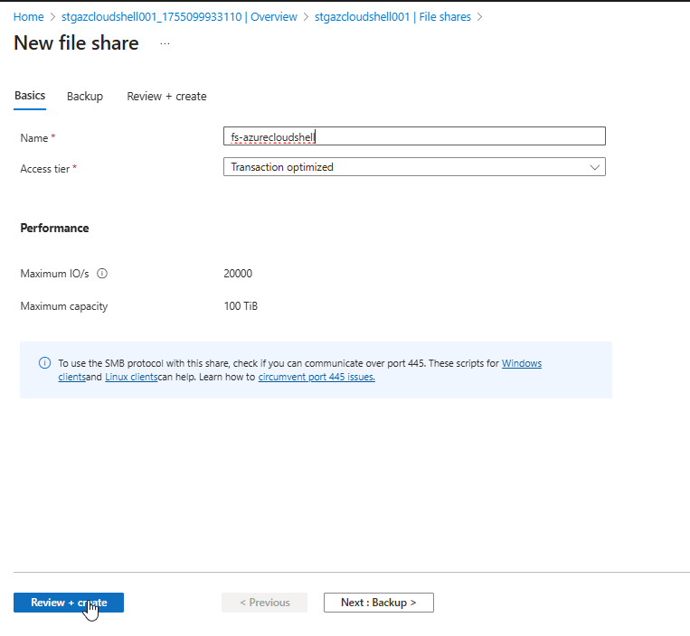
     
   **4. Creation in Progress**
   Your file share will be created and ready for use.

### Register resource providers [Check links](Resources.md)
Cloud Shell needs access to certain Azure resources. You make that access available through resource providers. The following resource providers must be registered in your subscription:

- Microsoft.CloudShell
- Microsoft.ContainerInstance
- Microsoft.Relay

Depending on when your tenant was created, some of these providers might already be registered.

To see all resource providers and the registration status for your subscription:

1. Sign in to the Azure portal.
2. On the Azure portal menu, search for Subscriptions. Select it from the available options.
3. Select the subscription that you want to view.
4. On the left menu, under Settings, select **Resource providers**.
5. In the search box, enter **cloudshell** to search for the resource provider.
6. Select the **Microsoft.CloudShell** resource provider from the provider list.
7. Select **Register** to change the status from unregistered to registered.
8. Repeat the previous steps for the **Microsoft.ContainerInstance** and **Microsoft.Relay** resource providers.

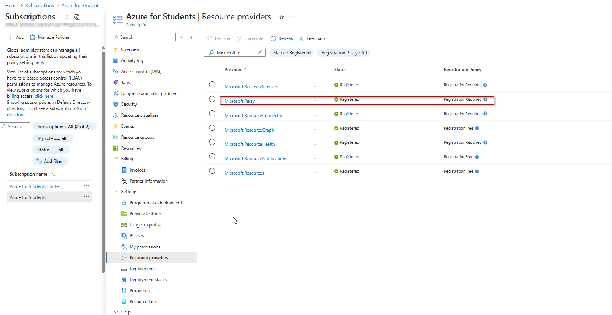

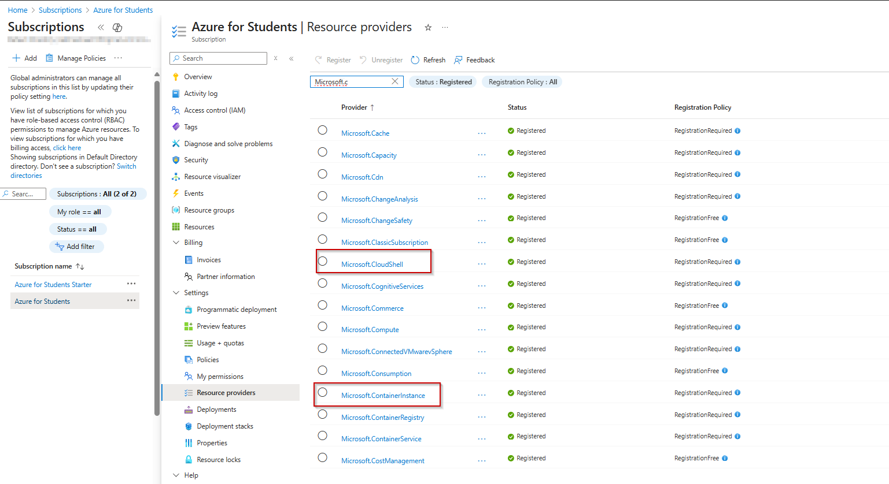

### Get The Azure container instance ID

The Azure container instance ID is a unique value for every tenant. 

1. Sign in to the Azure portal. From the home page, select **Microsoft Entra ID**. If the icon isn't displayed, enter Microsoft Entra ID in the top search bar.

2. On the left menu, select **Overview**. Then enter **azure container instance service** in the search bar.

3. In the results, under **Enterprise applications**, select **Azure Container Instance Service**.
   
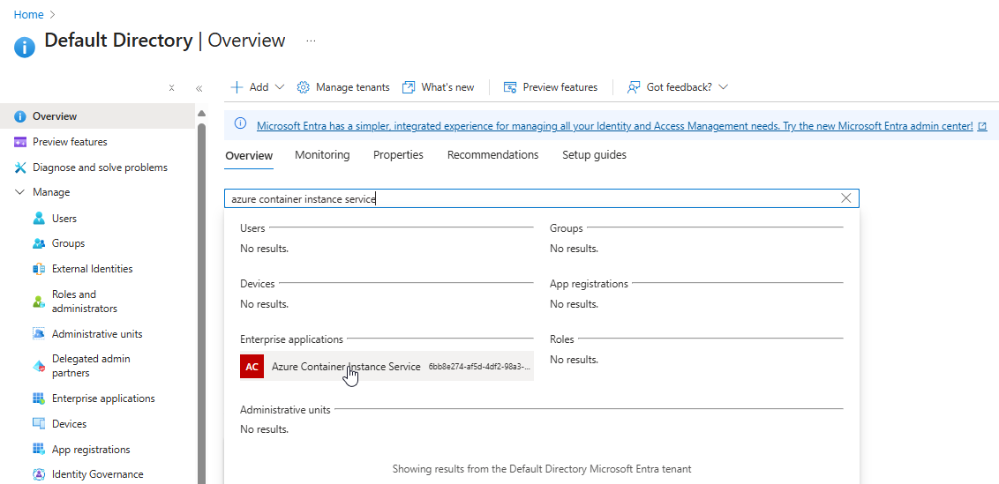

4. On the **Overview** page for **Azure Container Instance Service**, locate the **Object ID** value listed under **Properties**. Click the button **Copy to clipboard**

You use this ID in the quickstart template for the virtual network.

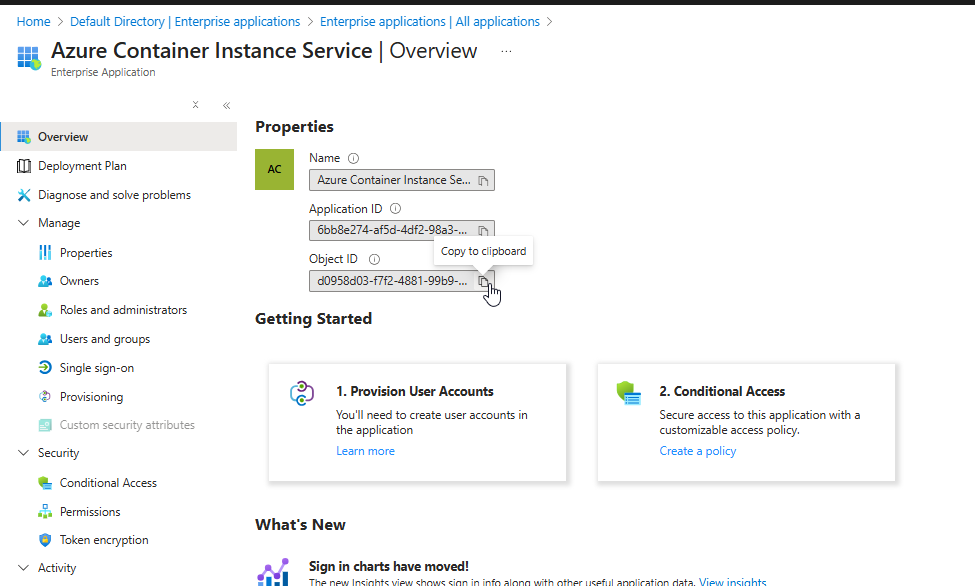

##   Azure Relay Deployment & configure Cloud Shell

### Deploy Azure Relay Namespace

The Azure Relay namespace, along with all required network components and authorization settings, will be deployed automatically using an ARM Template.  
- To deploy these resources into your Azure subscription, use the link below:

[🔗 Deploy via Azure Cloud Shell – VNet Quickstart Template](https://learn.microsoft.com/en-us/samples/azure/azure-quickstart-templates/cloud-shell-vnet/)

- Click on **Deploy to Azure**

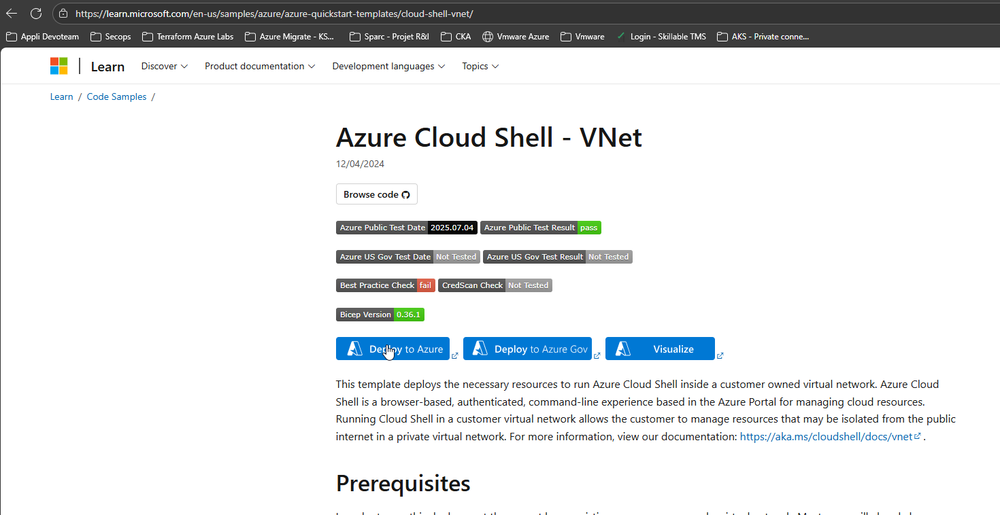

- When deploying Azure Cloud Shell ARM ensure that you:

   - Provide the required information, including the name of the existing VNet you deployed.
   - Use the same resource group for both the Storage Account (created in earlier steps) and the Azure Cloud Shell – VNet deployment.

⚠️ Important:
If the Storage Account and VNet are not in the same resource group, Cloud Shell will not be able to associate the VNet with the Storage Account, and the configuration will fail.

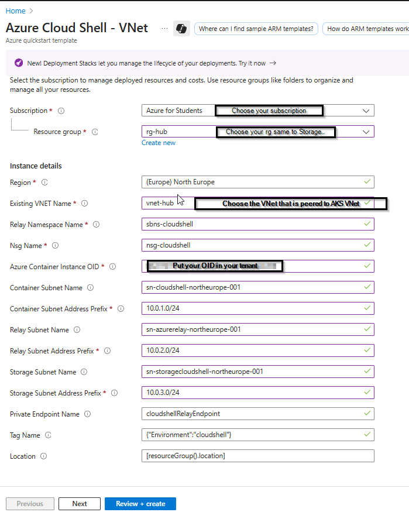

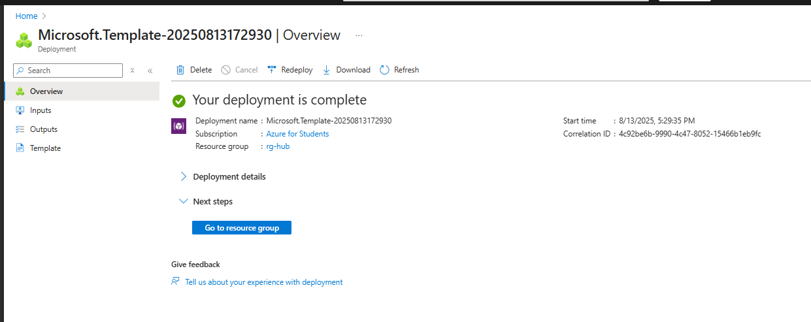

### Configure Cloud Shell within the Hub VNet (or VNet of your choice that is peered to AKS VNet)

**1. Open Azure Cloud Shell**

- Go to the Azure Portal and click the Cloud Shell icon in the top navigation bar.
  
**2. Access the Settings Menu**  

- In the Cloud Shell window, click the gear icon (⚙️) located in the top-left corner of the toolbar.

**3. Select "Reset User Settings"**  

- From the dropdown menu, choose "Reset User Settings". This will reset your Cloud Shell environment.
  
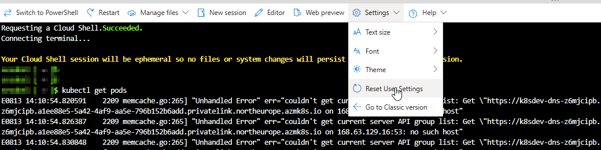
  
**4. Confirm the Reset**   
- You’ll be prompted to confirm the reset. Accept to proceed.

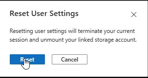
  
**5. Choose Your Shell Environment** 

- After resetting, select either Bash or PowerShell as your preferred shell.

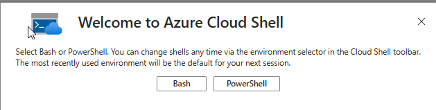

  
**6. Reconfigure Storage (if needed)**  

- You may need to remount your Azure File Share or create a new one.

**⚠️Note: Resetting Cloud Shell will erase any files not stored in your mounted Azure File Share. Make sure important files are backed up.**

**7. Select an existing private virtual network**

- Check the box **"Use an existing private network"**.
- Click **Apply** to proceed.

** ⚠️ Note: In this step you can choose to mount storage account or not to use storage account. Cloud Shell in a private virtual network using Azure Relay requires a storage account - File Share**. 

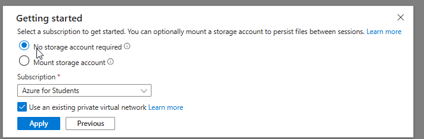

**8. Complete the Required Configuration Fields**

- Fill in all necessary fields to finalize the setup.

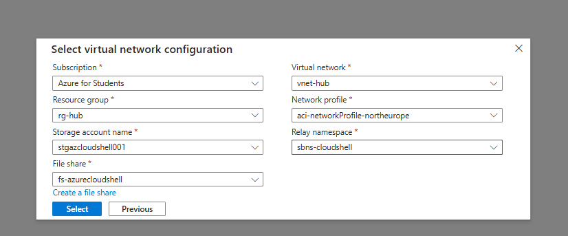

**9. Requesting a Cloud Shell in private virtual network**

- In the image below, a new Azure Container Instance (ACI) is being provisioned within your Virtual Network (VNet). The assigned IP address will be allocated from the Container Subnet, which was configured during the deployment of the Azure Cloud Shell VNet. 

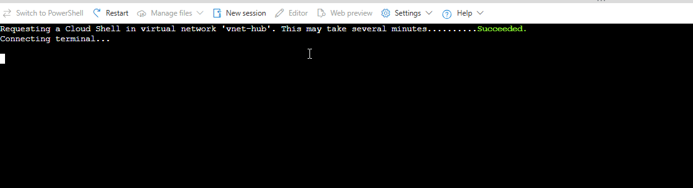

**⚠️Important Note:  
On ACI IP Visibility When verifying the IP address of the Azure Container Instance (ACI), you’ll notice that it is assigned from the Container Subnet configured during the deployment of the Azure Cloud Shell VNet. However, please be aware that this IP address will not appear under Connected Devices in the Azure Portal's Virtual Network view. This behavior is expected, as the ACI networking is fully managed by Azure and does not expose the container's IP in the standard VNet device list.  
💡 Community Request:
If anyone has found a method to retrieve or surface this information within their subscription, please feel free to reach out to me.**

### Use Cloud Shell to securely connect to the AKS private endpoint

  
## ✅ Connection Verification
Confirm access paths:
From Portal → Cloud Shell → Private Endpoint AKS

