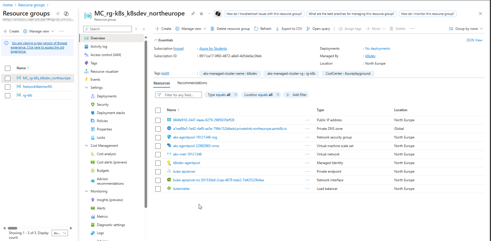

# 🚀 Deployment Flow Overview
This guide outlines the steps to deploy and securely connect to an Azure Kubernetes Service (AKS) private cluster using Cloud Shell with VNet integration, following a hub-and-spoke network topology.

 ## Access Options Flow 
For the purpose of this demonstration, access to the AKS private cluster will be established using Access Option 3.   

## 🧱 Existing Infrastructure 
- Using a Free Azure Subscription 
- Owner role already assigned on the subscription. 
- Hub & spoke Network Topology is already configured:
    - *Hub VNet*:  Hosts Cloud Shell (VNet-integrated).
    - *Spoke VNet*: Hosts the AKS Private Cluster.
    - *VNet Peering*: Established between Hub and Spoke VNets.

## ☸️ AKS Private Cluster Deployment

- To deploy the AKS private cluster with a private API server endpoint, follow these steps in the Azure Portal:
**1. Navigate to AKS Service**    
   - Go to the Azure Portal and search for Kubernetes services, then click Create.

**2. Configure Basics**
  - Fill in the required fields such as:
    -  Subscription  
    -  Resource Group  
    -  Cluster name   
    -  Region   

**3. Click "Next" Until You Reach the Networking Tab**   
Proceed through the tabs (Node Pools, Authentication, etc.) until you reach Networking.   

**4. Enable Private Access**  
In the Networking tab:
  - Check Enable private cluster (Note: The option Public access - Set authorized IP ranges will be greyed out) 
  - If you have already created an Azure Virtual Network, you may choose to use it by selecting the **Bring your own VNet** option. Otherwise, leave it unchecked to allow Azure to automatically create a new Virtual Network for the cluster. 
  - Optionally configure DNS name prefix or leave it to be auto-created.   
  - Review + Create   

**5. Edit the name of Infrastructure Resource Group** 
- In Advanced tab:   
   - If you need to modify the name of infrastructure resource group of AKS, click on Edit and change the name.      

7. Click Review + Create, validate the configuration, and then click Create to deploy the cluster.

## What looks like Infrastructure Resource Group Resources

The following resources are provisioned as part of the AKS cluster deployment. 

## 🔗  Link Hub VNet (VNet where Cloud Shell ACI will be deployed) to Private DNS Zone. 
1. Locate the AKS Private DNS Zone
Go to Private DNS Zones in Azure Portal.
The zone name will look like:
privatelink.<region>.azmk8s.io
(e.g., privatelink.northeurope.azmk8s.io)
2. Link the Hub VNet to the Private DNS Zone
- In the Private DNS Zone:
  - Go to Settings → Virtual Network Links
  - Click + Add
Enter a Link Name (e.g., hub-vnet-link)
Select the Hub VNet from the dropdown
Choose whether to enable Auto-registration (usually disabled for AKS)
Click OK

##   Azure Relay Deployment & configure Cloud Shell
- Deploy Azure Relay 
- Configure Cloud Shell within the Hub VNet (or VNet of your choice that is peered to AKS VNet)
- Use Cloud Shell to securely connect to the AKS private endpoint

  
## ✅ Connection Verification
Confirm access paths:
From Portal → Cloud Shell → Private Endpoint AKS

